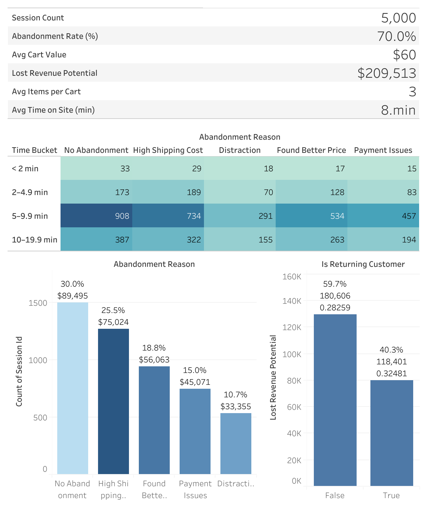
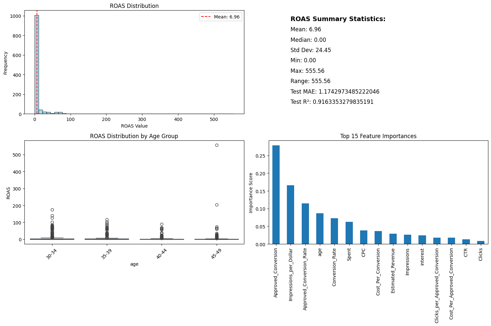
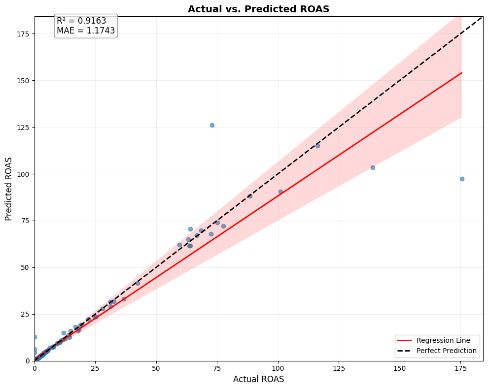
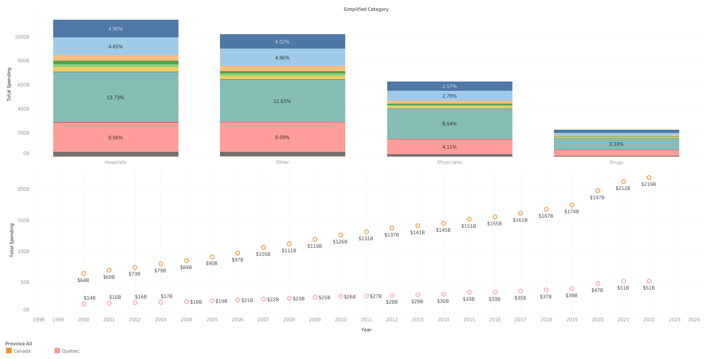
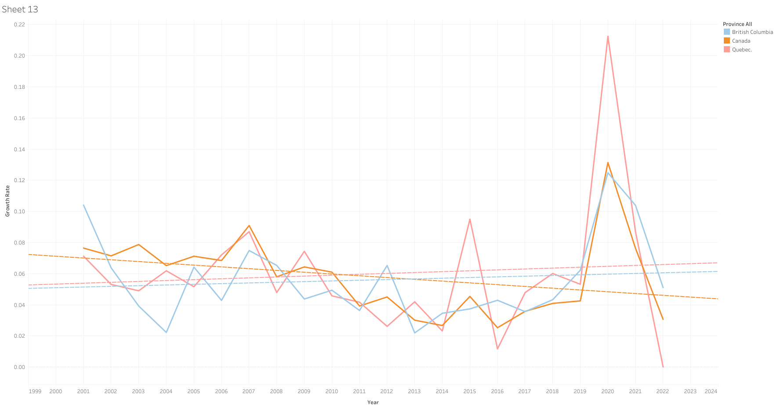

# Seokhyun Yoon – Data Analyst Portfolio

## 👋 About Me

Hello, I'm **Seokhyun Yoon** — a recent Statistics graduate from Simon Fraser University seeking **entry level Data Analyst opportunities across Canada**. I'm passionate about using data to solve practical business problems and help teams make better decisions.

My foundation includes **SQL, Python, Excel, Tableau, Power BI**, and statistical analysis. Through academic projects and self-directed learning, I've developed skills in data cleaning, exploratory analysis, dashboard creation, and communicating insights to non-technical stakeholders.

I'm looking for a team where I can contribute immediately while learning from experienced analysts. **Open to junior, contract, or hybrid roles anywhere in Canada.**

✍️ [View My Resume (PDF)](https://github.com/SeanYooon/Data-Analysis-Portfolio-/blob/main/Sean%20Resume.pdf)  
🔗 [Visit My LinkedIn](https://www.linkedin.com/in/seokhyun-yoon-241a61104/)

---

## 🧩 Core Skills

- **Data Analysis:** SQL (queries, joins, aggregation), Python (pandas, data cleaning), Excel (pivot tables, VLOOKUP, charts)
- **Visualization:** Tableau (interactive dashboards, KPIs), Power BI (business reporting)
- **Statistics:** Descriptive statistics, trend analysis, A/B testing fundamentals
- **Data Engineering:** dbt (data transformations), Snowflake (cloud data warehouse)
- **Tools:** Git/GitHub, Jupyter Notebooks, VS Code
- **Soft Skills:** Clear communication, problem solving, attention to detail, teamwork

---

## 📊 Featured Projects

### 1. 🛒 E-Commerce Cart Abandonment Analysis & Executive Dashboard

**Business Problem:**  
An e-commerce company needed to understand why 70% of customers were abandoning their shopping carts before checkout.

**My Approach:**
- Cleaned and analyzed over 5,000 customer session records using **SQL** to identify patterns  
- Performed exploratory analysis to uncover abandonment drivers (shipping costs, payment issues, session time)  
- Built an interactive **Tableau dashboard** tracking abandonment metrics by customer segment and product category  
- Compared effectiveness of discount coupons vs. loyalty programs using cohort analysis  

**Tools Used:** PostgreSQL, Python (pandas, matplotlib), Tableau  

**Key Insights:**
- High shipping costs ($20+) drove **$75K in lost revenue**, 36% of all abandonment  
- Mobile users abandoned at 1.5× the rate of desktop users  
- Customers who abandoned once had a 45% probability of completing a purchase after an email follow-up  

**Business Impact:**  
Quantified **$209K revenue recovery opportunity** and recommended prioritizing loyalty programs over generic discounts based on customer lifetime value analysis.  

**Visuals:**  

| KPI Overview | 
|--------------|
|  

📊 [View Interactive Dashboard](https://public.tableau.com/views/CartAbandonment_17561755499880/Dashboard1?:language=en-US&:sid=&:redirect=auth&:display_count=n&:origin=viz_share_link))  
💻 [View Project Files](https://github.com/SeanYooon/Data-Analysis-Portfolio-/edit/main/README.md#cart-abandonment--executive-dashboard)

---

### 2. 📈 Canadian Labour Market Analysis (2020–2025)

**Business Problem:**  
Understanding employment and wage trends across Canadian provinces to identify regions with strong job growth and earning potential.

**My Approach:**
- Downloaded and cleaned **Statistics Canada Labour Force Survey data** (Table 14-10-0287-03) covering 10 provinces  
- Analyzed employment trends by province, industry sector, and wage levels using **Python**  
- Identified provinces with highest job growth rates and average wage increases  
- Created **Power BI dashboard** to visualize regional labour market differences  

**Tools Used:** Python (pandas, matplotlib, seaborn), Power BI, Statistics Canada Open Data  

**Key Insights:**
- Alberta showed the **fastest employment recovery** post-2023 (+1.7% in Sept 2025) despite high unemployment  
- Manitoba and Saskatchewan had the **lowest unemployment rates** (6.2% and 5.8%)  
- Average weekly earnings grew **3.3% year over year** nationally, with tech and healthcare leading  
- BC and Ontario had the highest wage levels but also the highest competition for entry-level roles  

**Business Impact:**  
Created actionable insights for job seekers identifying **high-opportunity provinces** with strong employment growth and competitive wages.  

📊 [View Dashboard](https://github.com/YourUsername/canada-labour-analysis)  
💻 [View Analysis Code](https://github.com/SeanYooon/Data-Analysis-Portfolio-/edit/main/README.md)

---

### 3. 💹 Ad Campaign ROAS Analysis

**Business Problem:**  
A digital marketing team needed to evaluate return on ad spend (ROAS) across multiple channels and optimize budget allocation.

**My Approach:**
- Consolidated campaign data from Google Ads, Facebook, and email marketing using **Excel**  
- Calculated ROAS, conversion rates, and customer acquisition costs by channel  
- Built dashboards in **Tableau** and **Power BI** for stakeholder presentations  
- Recommended budget reallocation based on performance metrics  

**Tools Used:** Excel, Tableau, Power BI  

**Key Insights:**
- Email campaigns delivered **highest ROAS at 4.2×** vs. paid social at 2.1×  
- Google Search ads had the best conversion rate (8.5%) but limited scale  
- Facebook ads drove volume, but lower quality leads (3.2% conversion)  

**Business Impact:**  
Recommended shifting 30% of the budget from Facebook to email remarketing, projecting **15% improvement in overall ROAS**.  

**Visuals:**

| ROAS by Channel                            |  Cost Effectiveness Comparison         |
|-------------------------------------------------------|--------------------------------------------|
|    |  |

📊 [View Analysis Report](https://github.com/SeanYooon/Data-Analysis-Portfolio-/edit/main/README.md#ad-campaign-roas-analysis)

---

### 4. 📈 Customer Churn Analysis

**Business Problem:**  
A subscription service wanted to reduce customer churn and identify at-risk segments.

**My Approach:**
- Queried customer behavior data using **SQL** to identify drop-off points  
- Performed exploratory analysis in **Python** examining churn factors (contract type, service usage, payment method, customer support interactions)  
- Created monthly churn reports with visualizations for management review  
- Identified high-risk customer segments for targeted retention campaigns  

**Tools Used:** SQL, Python (pandas, matplotlib, seaborn)  

**Key Insights:**
- Month-to-month contracts had **42.7% churn rate** vs. 2.8% for annual contracts  
- Customers without tech support usage were **3× more likely** to churn within six months  
- Electronic payments correlated with **lower churn** (18%) vs. manual payments (32%)  

**Business Impact:**  
Identified **top three retention priorities** and created data-driven recommendations for reducing churn through contract upgrades and proactive support.  

💻 [View Project Code](https://github.com/SeanYooon/Data-Analysis-Portfolio-/blob/main/README.md#customer-churn-analysis--prediction-dashboard)

---

### 5. 🏥 Canadian Health Spending Analysis (2010–2023)

**Business Problem:**  
Understanding trends in Canadian healthcare expenditure by province and spending category to inform policy discussions.

**My Approach:**
- Extracted healthcare spending data from **CIHI open data**  
- Built a data transformation pipeline using **dbt** and **Snowflake**  
- Created an interactive **Tableau dashboard** showing per-capita spending and category trends  
- Compared provincial spending priorities (hospitals, physicians, drugs)  

**Tools Used:** Python, dbt, Snowflake, Tableau  

**Key Insights:**
- Per-capita health spending grew **6.2% annually** (2010–2023)  
- Hospital services represented **38%** of total spending  
- Alberta and Ontario had **highest per-capita spending**, Quebec most efficient delivery  
- Prescription drug spending grew **fastest** at 8.1% CAGR  

**Business Impact:**  
Delivered a visualization tool for policy analysts to explore spending patterns and benchmark provincial performance.  

**Visuals:**

| Stacked Bar + Dot Line – Spending by Category and Total Trend                              | Line Chart – YoY Growth Rate (Canada vs Quebec vs BC)         |
|-------------------------------------------------------|--------------------------------------------|
| |  |

**Github Repo**
[1] GitHub -[https://github.com/SeanYooon/Data-Analysis-Portfolio-](https://github.com/SeanYooon/snowflake_dbt)

---

## 🎓 Additional Academic & Learning Projects

These projects were completed as part of university coursework and independent study. They demonstrate long-term learning and advanced technical exploration.

- **[Credit Risk Prediction Model](https://github.com/SeanYooon/Data-Analysis-Portfolio-/blob/main/README.md#credit-risk-prediction--scoring-banking-grade-ml-pipeline)** – Banking analytics using XGBoost, SHAP interpretability, and SMOTE sampling (Python)
- **[Housing Price Prediction](https://github.com/SeanYooon/Data-Analysis-Portfolio-/blob/main/README.md#housing-price-prediction)** – Regression modeling with feature engineering and cross-validation (Python, R)
- **[Time Series Forecasting – Rainfall Prediction](https://github.com/SeanYooon/Data-Analysis-Portfolio-/blob/main/README.md#rainfall-forecasting-time-series)** – SARIMA and Prophet models for weather forecasting (Python)
- **[SpaceX Falcon 9 Landing Prediction](https://github.com/SeanYooon/Data-Analysis-Portfolio-/blob/main/README.md#spacex-falcon-9-landing-prediction)** – Classification project from IBM Data Science course (Python, Tableau)
- **[Police Complaints Prediction (Vancouver)](https://github.com/SeanYooon/Data-Analysis-Portfolio-/blob/main/README.md#police-complaints-prediction)** – Predictive modeling using civic data (R, ggplot2)
- **[Donor Management CRM – Finding Donors](https://github.com/SeanYooon/Data-Analysis-Portfolio-/blob/main/README.md#donor-management--crm-analytics-project)** – Supervised learning project for CharityML (Python)
- **[Insurance Cost Analysis](https://github.com/SeanYooon/Data-Analysis-Portfolio-/blob/main/README.md#insurance-cost-analysis-excel)** – Statistical analysis of healthcare cost drivers (Excel, Tableau)

---

## 🎯 Career Goal

To build practical analytics experience starting from data cleaning, reporting, and dashboard maintenance, learning industry operations and gradually applying advanced analytical methods to solve real-world business problems.

I'm particularly interested in industries like finance, healthcare, retail, and technology where data-driven decision making creates measurable business impact.

---

## 💬 Let's Connect

If you're looking for someone detail-oriented, eager to learn, and ready to take on entry-level analytics responsibilities, I'd love to connect and discuss how I can add value to your team.

📧 **Email:** [Seokhyun.sean.yoon@gmail.com]

💼 **LinkedIn:** [LinkedIn](https://www.linkedin.com/in/seokhyun-yoon-241a61104/)

🐙 **GitHub:** [Github](https://github.com/SeanYooon/Data-Analysis-Portfolio-/blob/main/README.md)

